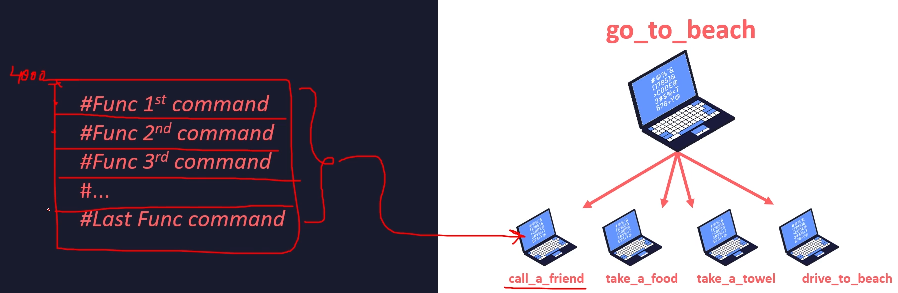

# C Lang 102
[docs](https://cplusplus.com/reference/cstring/strtok/?kw=strtok);

https://en.cppreference.com/w/c/memory/malloc;

C is pass by value language. Even if you pass an address to a function, you pass a copy of that address. You can dereference if from inside the function and change its value, but still, the function accepts a copy of an address => pass by value. In this matter, C is just like Java.

C++ seems to support pass by reference.

## Data Types

C Lang spec does not define the size of an integer and it might depend upon the platform. `stdint.h` header specifies exact int types:


;

Literal of unsigned int is, for instance, `unsigned int a = 123U`;

Literal of long int is, for instance, `long int b = 99999999999L`;

C Lang does not have boolean, but you can use `stdbool.h` header to be able to use disguise int for bool.

`NULL` is defined in `stddef.h` header.

## Operators

### Precedence


;

### Bitwise operators


Bit operators are used for bit manipulations


#### Venn diagram


;

### Size of

```c
size_t my_size = sizeof(int);
```

`size_t` size depends on the platform.

### Implicit conversion


;

## Pointers and arrays


### Const pointers


;

### Pointers arithmetic

```c
#include <stdio.h>

// int arr[] is just a syntatic sugar, but it's basically int *arr
// do NOT try int len = sizeof(arr) / sizeof(arr[0]);
int pointers_arithmetic(const int len, const int arr[len])
{
    for (const int *p_item = arr; p_item < arr + len; p_item++)
    {
        printf("p_item is %p\n", p_item);
        printf("*p_item is %d\n", *p_item);
        printf("offset is %ld\n", p_item - arr);
        printf("\n");
    }
}

int main()
{
    int arr[] = {1, 2, 3, 4, 5};
    int *arr_p = arr;
    int (*fp)[5] = &arr;
    printf("arr_p=%p == fp=%p\n", arr_p, fp);
    printf("\n");

    // this trick of calculating size only works for static arrays and only in the scope of the function.
    int len = sizeof(arr) / sizeof(arr[0]);
    pointers_arithmetic(len, arr);

    int vlen = 6;
    int varr[6]; // cannot init a variable length arr
    for (int i = 0; i < vlen; i++)
    {
        varr[i] = i;
        printf("%d", varr[i]);
    }
    printf("\n");

    char str[] = "My String";
    // str = "Another String"; // compilation error
    char *str_ptr = "Str pointer";
    str_ptr = "Another string";
}	
```

;

### Strings

We can represent a 2D array of strings in different ways

```c
char days[][10] = {"Monday", "Tuesday", "Wednesday", "Thursday", "Friday", "Saturday", "Sunday"}; // 1
char *days2[] = {"Monday", "Tuesday", "Wednesday", "Thursday", "Friday", "Saturday", "Sunday"}; // 2
```

If you use a 2D array for type declaration, it'll have the following memory layout.


If you use a pointer for 1D array, you'll get an array of pointers:

#### Tools

defined in `<stdlib.h>`;


defined in `<ctype.h>`:


;

## Free

You cannot free:

1. Uninitialized pointer.
2. The same pointer twice.
3. memory partially.
4. static arrays.

Dangling pointer is a pointer that points to freed memory.

`Valgrind` - is a tool to find memory leakages.

## Memory allocation

```c
int arr_size = 5;

int *arr = (int *)malloc(arr_size * sizeof(int));
int *arr2 = (int *)calloc(arr_size, sizeof(int));

if (arr == NULL || arr2 == NULL)
{
    printf("Cannot allocate memory\n");
}
int new_size = 7;
int *reallocated = (int *)realloc(arr2, new_size * sizeof(int));
// If pointer passed to realloc is NULL, then realloc behaves just the same as malloc

int *p3 = malloc(4 * sizeof *p3); // allocate size for 4 ints. In this way you don't have to repeat the type twice.
```


;

### Natural data alignment


data is considered naturally aligned when its `address mod size EQ 0`.

Data access is most efficient when data is naturally aligned.

```c
#include <stdio.h>

// ASSUMING THAT IS 32bit system!

typedef struct BadStruct
{
    char x;   // 1
    double y; // 8
    int z;    // 4
} BadStruct;  // sum == 13
// padding is based on the larges member of the struct, in this case double.
// Since int and char get naturally aligned to double,
// we get actual total size of 24 bytes!


// If you use the correct order of struct members, you can safe some memory.
// In this case, total actual size will be 16 bytes (3 additional bytes for padding char)!
typedef struct GoodStruct
{
    char x;   // 1
    int z;    // 4
    double y; // 8
} GoodStruct; // sum == 13

int main()
{
    BadStruct ms = {.x = 'a', .y = 1.0, .z = 4};
    printf("sizeof(BadStruct) == %ld\n", sizeof(ms));

    GoodStruct gs = {.x = 'a', .y = 1.0, .z = 4};
    printf("sizeof(GoodStruct) == %ld\n", sizeof(gs));

    puts("");
    return 0;
}

// 12 bytes:
// - 2 for short + 2 padding
// - 4 for int
// - 1 for char + 3 padding
typedef struct A
{
    short v1;
    int v2;
    char v3;
} A;


// 20 bytes:
// - 1 for char + 3 padding
// - 4 for int
// - 12 for A
typedef struct B
{
    char v1;
    int v2;
    A v3;
} A;
```

;

## Preprocessors and macros

### Preprocessor directives


### Predefined macros


*`__DATE__` and `__TIME__` as of compilation date.

## IO

https://en.cppreference.com/w/c/io

https://en.cppreference.com/w/c/io/ferror

https://en.cppreference.com/w/c/io/fread

https://en.cppreference.com/w/c/io/fwrite

https://en.cppreference.com/w/c/io/fprintf

https://en.cppreference.com/w/cpp/error/assert - for simple testing

;

## Modules


Header file - exposes "interfaces of the module". 


To avoid multiple declarations, you should use include guards, for instance:

```c
#ifdef LED_H
#define LED_H

#define LED_ON 1
#define LED_OFF 0
typedef int Led;

#endif
```

;

## Pointers to functions



;
